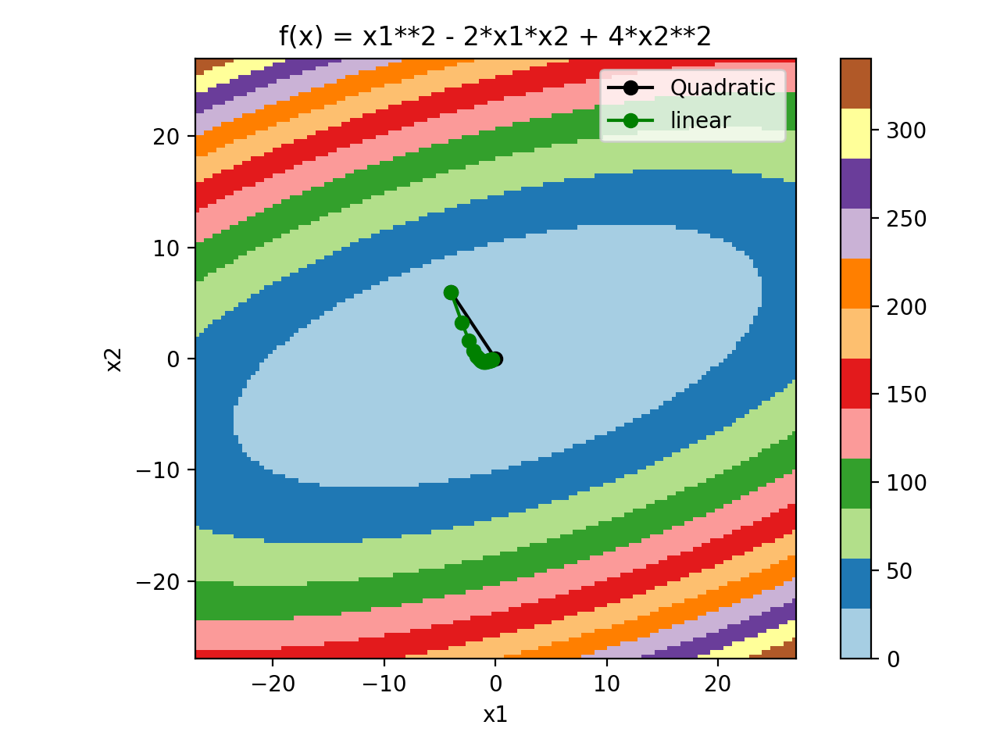

# Second_Order_Optimization_Newtons_Method

# Coding Challenge - Due Date, Thursday June 29th 2017 at 12 PM PST

This weeks challenge is to implement Newton's Method for optimization from scratch yourself in a Jupyter Notebook. You can use a toy dataset. Bonus points are given if you compare your results to a first order optimization technique or use a dataset from [Kaggle](https://www.kaggle.com/datasets). 

## Overview

This is the code for [this](https://youtu.be/UIFMLK2nj_w) video on Youtube by Siraj Raval as part of The Math of Intelligence course. I've got 2 implementations of Newton's Method here. The first is the root finding version, and the other is the optimization version. They are both written in just numpy and scipy. Newton's Method uses the 2nd derivative for optimizing, which hints at a graphs curvature, has better step-wise performance, but is usually outperformed by gradient descent because computing the 2nd derivative is computationally expensive. 

## Dependencies

* numpy
* scipy
* matplotlib

Install dependencies with [pip](https://pip.pypa.io/en/stable/)

## Usage

Just run `python name_of_file` in terminal and it will compile.

## Credits

The credits for this code go to [Dsalaj](https://github.com/dsalaj) and [Dhomola](https://gist.github.com/danielhomola). I've merely created a wrapper to get people started.

## Comparation

|Function 1| Function 2|
|---|---|
| |  |